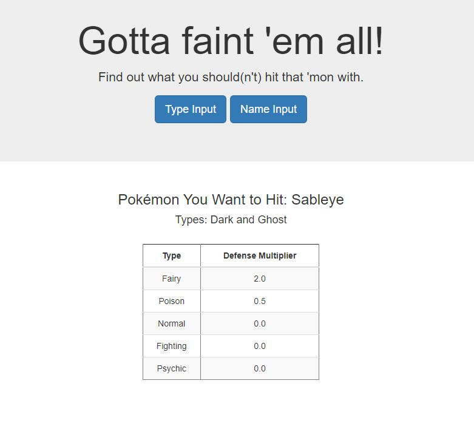

# pokemon-types
Web app to help with Pokémon battling. View deployment at: <a href="https://poke-typesmatchup.herokuapp.com/">https://poke-typesmatchup.herokuapp.com/</a>

## Data Sources
- [PokéAPI](https://pokeapi.co/)
- [PokémonDB](https://pokemondb.net/)

## Purpose

The purpose of this project was to build a web site that can tell you what moves you should or should not hit a Pokémon with when you're in a battle. Nine generations worth of 'mon is far too many for one brain to remember. 

Mechanically, it was a chance to work with API calls, regular expressions, and Flask application building with SQLite database files.
